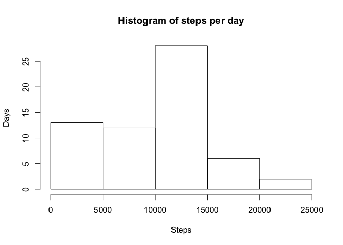
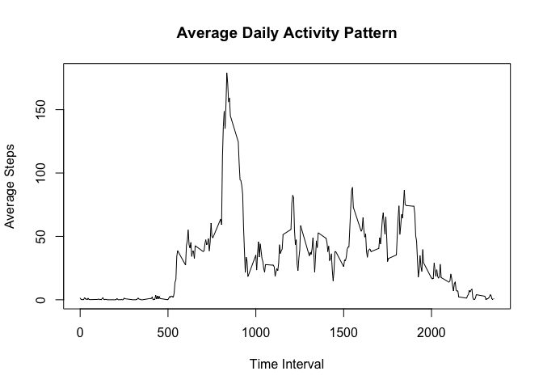
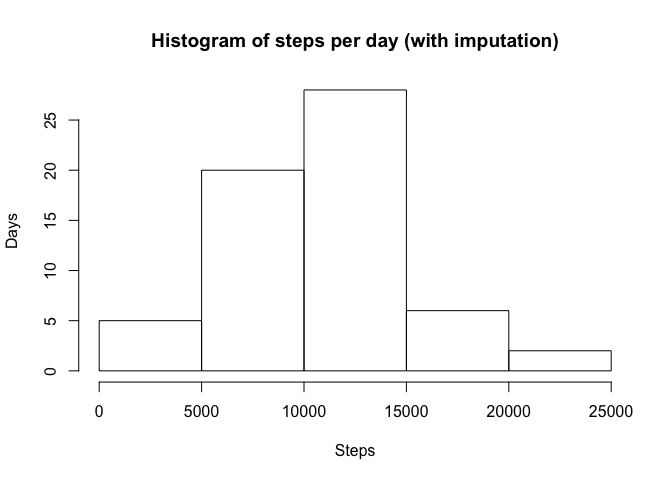
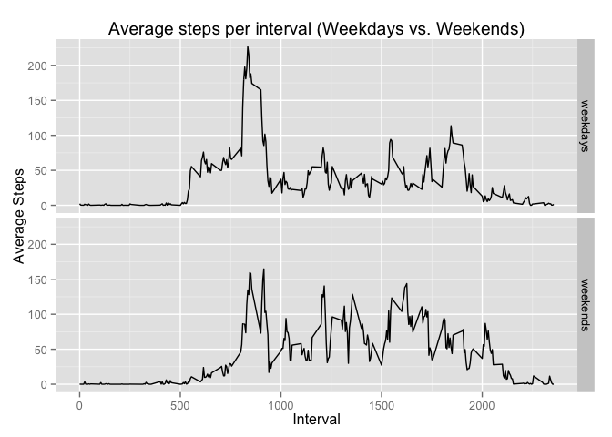

# Reproducible Research: Peer Assessment 1

This analysis required the following packages to be installed and loaded:

- dplyr
- ggplot2

```r
library(dplyr)
```

```
## 
## Attaching package: 'dplyr'
## 
## The following object is masked from 'package:stats':
## 
##     filter
## 
## The following objects are masked from 'package:base':
## 
##     intersect, setdiff, setequal, union
```

```r
library(ggplot2)
```


## Loading and preprocessing the data
This analysis expected:

- a file called activity.zip to be in the present working directory
- to unzip plus read in the .csv containted in the .zip.

```r
raw_data = read.csv(unz('activity.zip', 'activity.csv'))
str(raw_data)
```

```
## 'data.frame':	17568 obs. of  3 variables:
##  $ steps   : int  NA NA NA NA NA NA NA NA NA NA ...
##  $ date    : Factor w/ 61 levels "2012-10-01","2012-10-02",..: 1 1 1 1 1 1 1 1 1 1 ...
##  $ interval: int  0 5 10 15 20 25 30 35 40 45 ...
```


## What is mean total number of steps taken per day?
The raw data set has observations at 5 seccond intervals over consecutive days.

In some cases the steps variable (measurement) was not recorded and the value is NA.
This does not necessarily indicate a measurement of zero, and indeed some observations do have a measurement value of zero.

For the purpose of this exercise, these NA values were removed, therefore the mean is calculated across only the intervals that have a measured value.

- Calculate total steps per day:

```r
# Empty vector to hold a total steps variable for each day
sums = vector()
# Loop over each unique day and sum the steps variable for all the intervals on that day (ignoring NA values), storing the result in the new vector
for(day in unique(select(raw_data, date))[,1]){
    sums = c(sums, sum(filter(raw_data, date==day)[,'steps'], na.rm=TRUE))
}
```
- Make a histogram of the total number of steps taken each day:

```r
hist(sums, main='Histogram of steps per day', xlab='Steps', ylab='Days')
```

 
- Calculate the mean steps per day:

```r
day_steps_mean = mean(sums)
```
- Calculate the median steps per day:

```r
day_steps_median = median(sums)
```
The calculated mean is 9354 (9354.2295082).

The calculated median steps per day is 10395.


## What is the average daily activity pattern?
To determine the average daily activity pattern the raw_data is iterated over by interval number.
For each unique interval, the steps are summed across all days, then divided by the number of days.
The result is added to a new data.frame along with the interval number. 
This new data.frame is then bound to a collector data.frame (average_data).
Once all of the data points are gathered, a plot is created and the observation with the highest value for the 'steps' variable is determined.

- Calculate averages:

```r
# Create a new, empty, data.frame to hold results
average_data = data.frame()
# Determine the number of days in the data set
num_days = length(unique(select(raw_data, date))[,1])
# Loop over each unique interval, summing the steps for that interval across all days (ignoring NA values), and store results in the new data.frame
for(int in unique(select(raw_data, interval))[,1]){
    interval_steps = sum(filter(raw_data, interval==int)$steps, na.rm=TRUE)
    this_data = data.frame(interval=int, steps=interval_steps/num_days)
    average_data = rbind(average_data, this_data)
}
```
- Generate the plot:

```r
plot(average_data, type='l', main='Average Daily Activity Pattern', xlab='Time Interval', ylab='Average Steps')
```

 
- Determine the interval with the higest average step count:

```r
highest_observation = average_data[max(average_data$steps),]
```
Time interval 1450 has the highest average step measurement at 37.9 steps.


## Imputing missing values
Some of the observations in the raw_data are missing values - i.e. the values are NA.

- Calculate the number of observations with NA values:

```r
NAs = length(filter(raw_data, is.na(steps))$steps)
```
There are 2304 observations with NA values.

As these observations form 13.1147541% of the overall observations, which could be significant, the NAs will be imputed, the calculations from the first question will be re-run, and, the results compared in order to determine if there is a statistical significance to the presence of NA values.

The NA values will be imputed with the average steps across all non-NA observations for that given interval across all days.

- Copy the raw data set (raw_data) into a new data set (data):

```r
data = raw_data
```
- Impute NA values:

```r
# Iterate over every observation in the data set
for(i in c(1:length(raw_data$steps))){
    # If the steps variable is NA, impute with the average steps accross all days for that interval
    if(is.na(raw_data[i,'steps'])){
        data[i,'steps'] = filter(average_data, interval==raw_data[i,'interval'])$steps
    }
}
```
- Show that the original data set contained NAs:

```r
print(head(filter(raw_data, is.na(steps))))
```

```
##   steps       date interval
## 1    NA 2012-10-01        0
## 2    NA 2012-10-01        5
## 3    NA 2012-10-01       10
## 4    NA 2012-10-01       15
## 5    NA 2012-10-01       20
## 6    NA 2012-10-01       25
```
- Show that the new imputed data set does not contain NAs:

```r
print(head(filter(data, is.na(steps))))
```

```
## [1] steps    date     interval
## <0 rows> (or 0-length row.names)
```
In order to generate a histogram of the imputed data set, the process from question 1 is repeated:

- Calculate total steps per day:

```r
# Empty vector to hold a total steps variable for each day
imputed_sums = vector()
# Loop over each unique day and sum the steps variable for all the intervals on that day (ignoring NA values), storing the result in the new vector
for(day in unique(select(data, date))[,1]){
    imputed_sums = c(imputed_sums, as.integer(sum(filter(data, date==day)[,'steps'])))
}
```
- Make a histogram of the total number of steps taken each day:

```r
hist(imputed_sums, main='Histogram of steps per day (with imputation)', xlab='Steps', ylab='Days')
```

 

- Calculate the mean steps per day:

```r
imputed_day_steps_mean = mean(imputed_sums)
```
- Calculate the median steps per day:

```r
imputed_day_steps_median = median(imputed_sums)
```
The calculated mean is 9354 (9354.2295082).

The calculated mean is 10580 (1.0580984\times 10^{4}) after imputing NA values.

Imputing has A MEASURABLE affect on mean calculations.

The calculated median steps per day is 10395.

The calculated median steps per day is 10395 after imputing NA values.

Imputing has NO affect on median calculations.


## Are there differences in activity patterns between weekdays and weekends?
In order to differentiate weekday data from weekend data:

- add a column to the imputed data set, as a factor with two levels of 'weekday' and 'weekend':

```r
data = cbind(data, data.frame('day_type'=factor(NA, c('weekday', 'weekend'))))
str(data)
```

```
## 'data.frame':	17568 obs. of  4 variables:
##  $ steps   : num  1.4918 0.2951 0.1148 0.1311 0.0656 ...
##  $ date    : Factor w/ 61 levels "2012-10-01","2012-10-02",..: 1 1 1 1 1 1 1 1 1 1 ...
##  $ interval: int  0 5 10 15 20 25 30 35 40 45 ...
##  $ day_type: Factor w/ 2 levels "weekday","weekend": NA NA NA NA NA NA NA NA NA NA ...
```
- Calculate day_type value for each observation:

```r
# Loop over each observation in the imputed data set
for(i in c(1:length(data$steps))){
    # Determine the day associated with the date value for the iteration
    day = weekdays(as.POSIXlt(as.character(data[i,'date'])),FALSE)
    # If the day is a Saturday or Sunday, add 'weekend' as the value, otherwise add 'weekday'
    if(day == 'Saturday' || day == 'Sunday'){
        data[i,'day_type'] = 'weekend'
    } else {
        data[i,'day_type'] = 'weekday'
    }     
}
head(data)
```

```
##        steps       date interval day_type
## 1 1.49180328 2012-10-01        0  weekday
## 2 0.29508197 2012-10-01        5  weekday
## 3 0.11475410 2012-10-01       10  weekday
## 4 0.13114754 2012-10-01       15  weekday
## 5 0.06557377 2012-10-01       20  weekday
## 6 1.81967213 2012-10-01       25  weekday
```
- create a new data.frame (average_data) to store the average value for each interval for weekdays and weekends:

```r
average_data = data.frame()
```
- determine the number of weekdays and weekend days (for later use in determining averages):

```r
num_weekdays = length(unique(filter(data, day_type=='weekday')$date))
num_weekend_days = length(unique(filter(data, day_type=='weekend')$date))
```
- Calculate averages and add to the new data.frame:

```r
#Loop over all the unique intervals
for(int in unique(select(data, interval))[,1]){
    # For each interval sum all the interval values across weekdays, then separately, across weekend days
    interval_weekday_sum = sum(filter(data, day_type=='weekday', interval==int)$steps)
    interval_weekend_sum = sum(filter(data, day_type=='weekend', interval==int)$steps)
    # Build up a data structure for both weekdays and weekends, then concatenate with the average_data data.frame
    week_data = data.frame(interval=int, steps=interval_weekday_sum/num_weekdays, day_type='weekdays')
    end_data = data.frame(interval=int, steps=interval_weekend_sum/num_weekend_days, day_type='weekends')
    average_data = rbind(average_data, week_data, end_data)
}
```
- Finally, generate a line plot to compare weekday to weekend data 

```r
print(qplot(interval, steps, data=average_data, main='Average steps per interval (Weekdays vs. Weekends)', xlab='Interval', ylab='Average Steps', geom='line', facets=day_type~.))
```

 
